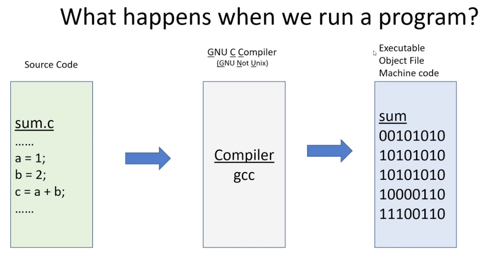
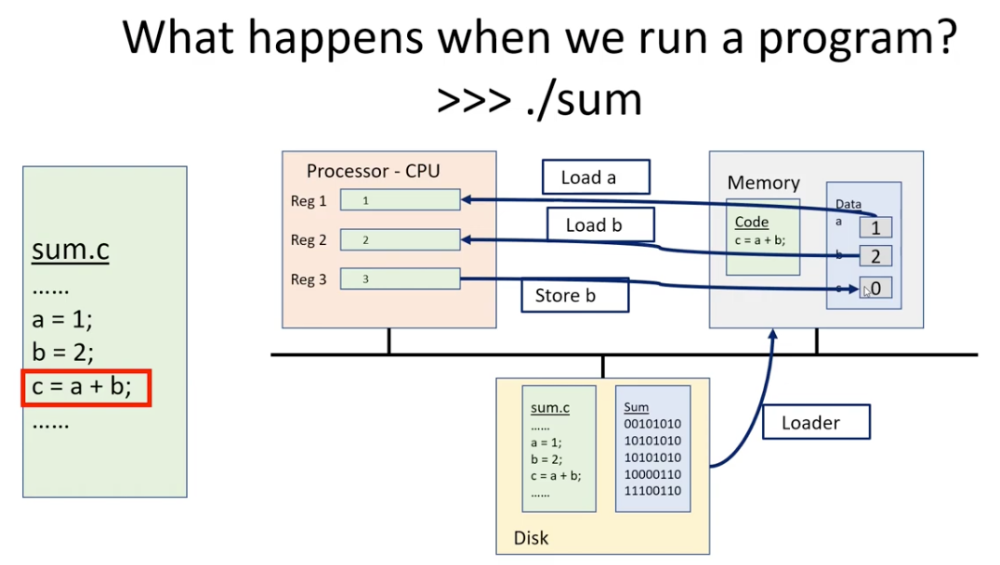
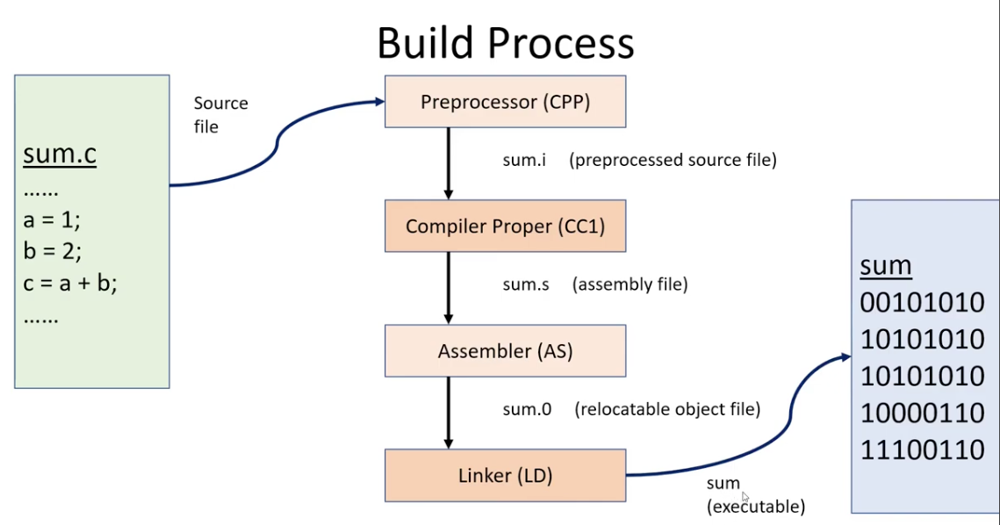

# Introduction

## Lecture 01 (2026-09-03)

Note: I've copied the html file from the lecture notes in [GitHub](https://git.doit.wisc.edu/DAHL/cs354-outlines/-/tree/main?ref_type=heads). But I have not updated it as I have for this MarkDown. The html can serve as a blank template when looking back through material.

### An Example

Suppose we run the the following methods, insert and displaySum, on the same list in Java.

```java
public static void insert(List<Integer> list) {
    for(int i=0;i<Main.BIG_SIZE;i++)
	list.add(0,i);
}

public static void displaySum(List<Integer> list) {
    int sum = 0;
    for(int i=0;i<Main.BIG_SIZE;i++)
	sum += list.get(i);	
}

```

Which one runs faster? And, importantly, why? Well, it depends. We demonstrate some specific examples below with an ArrayList and a LinkedList. (List is an interface in Java.) The motivation is learning how the operations are running on the machine.

```java
import java.util.List;
import java.util.ArrayList;
import java.util.LinkedList;

public class Main {
    
    public static void insert(List<Integer> list) {
	for(int i=0;i<Main.BIG_SIZE;i++)
	    list.add(0,i);
    }

    public static void displaySum(List<Integer> list) {
	int sum = 0;
	for(int i=0;i<Main.BIG_SIZE;i++)
	    sum += list.get(i);	
    }

    public static int BIG_SIZE = 99999;
    
    public static void test(List<Integer> list) {
        long start = System.nanoTime();
        Main.insert(list);
        long mid = System.nanoTime();
        Main.displaySum(list);
        long end = System.nanoTime();
        
        System.out.println(list.getClass().getName());
        System.out.println("insert(): "+(mid-start)/(double)BIG_SIZE);
        System.out.println("displaySum(): "+(end-mid)/(double)BIG_SIZE);
    }
    
    public static void main(String[] args) {
	    Main.test(new ArrayList<>());
        Main.test(new LinkedList<>()); 
    }
}
```

### Discussion of Abstraction

**Motivation (Other Abstractions in Play)**
- Source Code (.java) is compiled into Byte Code (.class)
- Byte Code (.class) is run through Java Virtual Machine
- Java Virtual Machine itself a program compiled from C/C++ source
- JIT Compiler (optimization) compiles byte code into machine code
- Machine Code runs on CPU (with Help of Operating System)

Pros: More Portable, Less Code and Complexity

Cons: Slower to Do More Things, Limited Control and Access

### Course Motivation

Why is it worth our effort to learn about these abstractions?

Well, we wish to understand how computers are interpreting and running code. Without that understanding we lose runway for optimization. We are the ones writing code; we're not just users. So, as an engineer (in a sense) it's our job to understand the systems we build.

### Course Introduction (What)
Unit 1: Introduction to Bash and C Programming

Unit 2: Pointers and Virtual Memory

Unit 3: Dynamic Memory Allocators

Unit 4: Cache Design and Simulations

Unit 5: x86-64 Assembly (mostly reading)

Unit 6: Signals and Exceptions

Unit6+: ELF Files (Linking and Loading)

### Course Introduction (How)
Readings and Resources

Lecture Examples and Clarifications

Exercises (through two-chance Canvas quizzes)

Programming Projects (through Gradescope)

Unit Quizzes (through CBEF)

### Bash Introduction (Navigate and View Filesystem)
pwd - Print Working Directory

ls - LiSt (including with common arguments like -l -a)

cd - Change Directory

cat - conCATenate

tree

### Bash Introduction (Create New Files and Directories)
mkdir - MaKe DIRectory

touch - Time Of Use CHange (we won’t use this much)

Bash Introduction (Modify Files and Directories)

cp - CoPy

cp -r

scp

mv - MoVe

rm - ReMove

rmdir

rm -rf

gio trash

### Bash Introduction (Editing Files including Code)
nano - simplest to use, but offers fewest features

emacs - arguably most configurable and extensible

takes time to find and configure “modes” capabilities to your workflow

vim - arguably most efficient to make edits with, takes time to learn features “motions” / verbs

### C Introduction (Hello, World!)

```C
public class Main {
    public static void main(String[] args) {
	System.out.println("Hello, World!");
    }
}
```

```C
#include <stdio.h>
int main(int argc, char** argv) {
  printf("Hello, World!\n");
} 
```

## Personal Notes (Extra)

### Running a Program





# Build Process: Compiling Code

After we write the human-readable code, which is stored in a file, we run the compiler to produce the machine-readable code.

The compiler is a series of four programs that transform human-readable code into machine-readable code:

